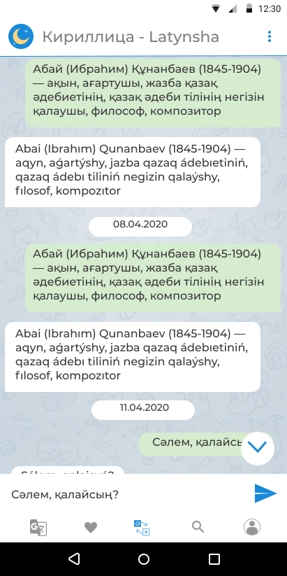
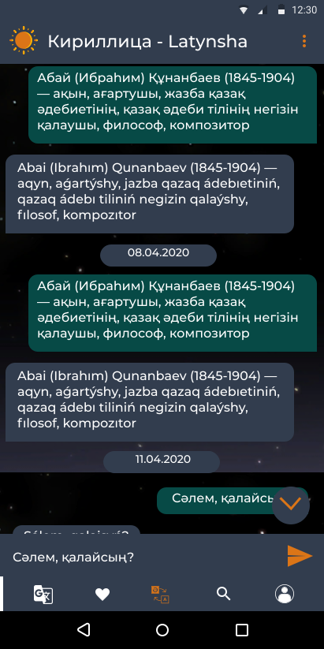
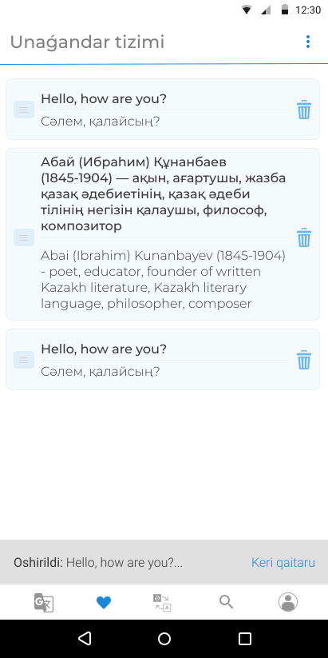
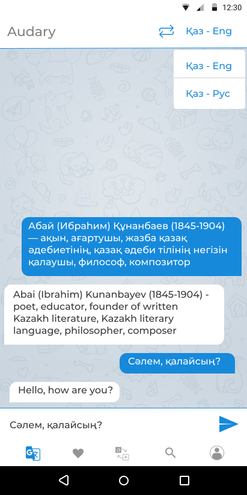
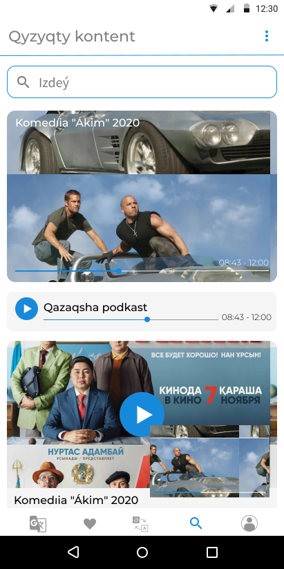
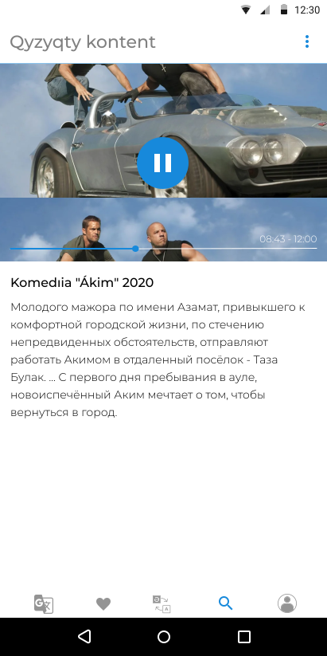
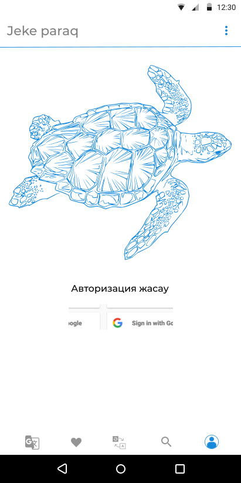
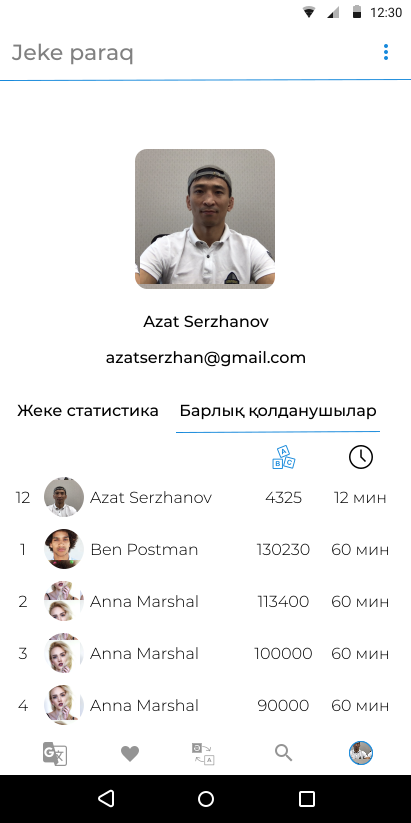
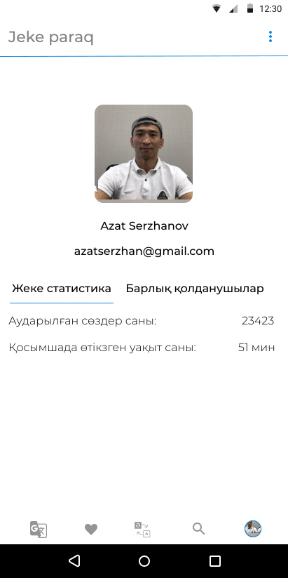

# Translator

## Applied concepts
* Arch. patterns: MVVM, MVP
* DI: Koin
* Jetpack libr: LiveData, ViewModel
* Network: Retrofit
* Multithreadin:g RxJava, Coroutines
* DB: Room
* Firebase Auth and Realtime DB
* Executors
* Gson
* Glide
* MotionLayout - Animations
* Splash screen with animation
* Recycler view with two types of view, touch listener - dragging, search in recycler. +DiffUtil.Callback
* Translation from Cirillic to Latin
* Day/Night theme
* CustomView

## Screenshots

  
   
   
 
